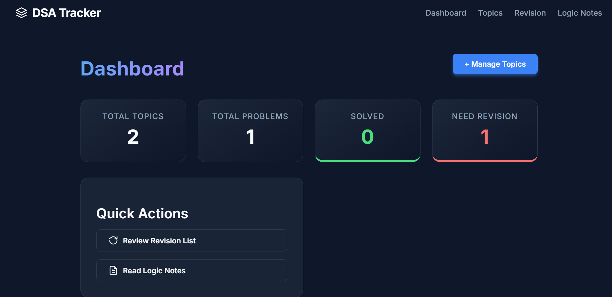
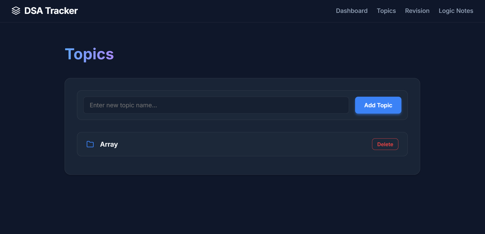
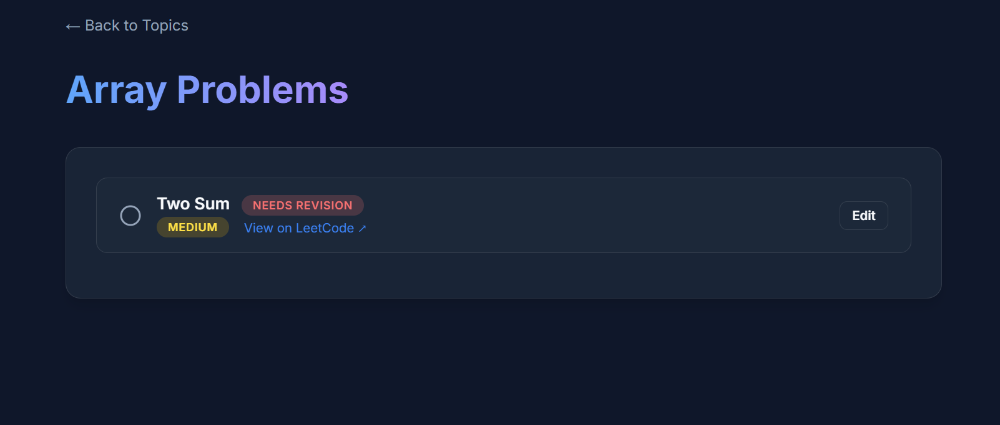

# DSA Tracker

A comprehensive Data Structures and Algorithms (DSA) problem tracker built with Django. This web application helps you organize, track, and review your progress as you solve coding challenges from platforms like LeetCode.

## Features

- **Dashboard Overview**: Get a quick glance at your progress with statistics on total topics, problems solved, and problems needing revision.
- **Topic Categorization**: Group problems by topics (e.g., Arrays, Linked Lists, Dynamic Programming) to structure your learning.
- **Problem Tracking**: Keep track of the problems you've solved. Each problem entry includes:
  - Problem Name
  - Difficulty Level
  - LeetCode Link
  - Solved Status
  - Needs Revision Status
- **Logic Notes**: Save your approach, logic, and notes for specific problems to easily recall them later without re-solving.
- **Revision List**: Dedicated view for all problems you have marked for later revision, helping you focus on areas that need more practice.
- **Manage Topics & Problems**: Easily add new topics, delete existing ones, and edit problem details as you progress.

## Screenshots

Here is a glimpse of the application:

### Dashboard


### Topics


### Problem List


## Technologies Used

- **Backend**: Python, Django
- **Database**: SQLite (default)

## Getting Started

### Prerequisites

- Python 3.8+
- pip (Python package installer)

### Installation

1. **Clone the repository** (if applicable) or navigate to the project directory:
   ```bash
   cd "Django-DSA Project"
   cd dsa_tracker
   ```

2. **Create a virtual environment**:
   ```bash
   python -m venv venv
   ```

3. **Activate the virtual environment**:
   - On Windows:
     ```bash
     venv\Scripts\activate
     ```
   - On macOS/Linux:
     ```bash
     source venv/bin/activate
     ```

4. **Install the dependencies**:
   ```bash
   pip install -r requirements.txt
   ```

5. **Apply database migrations**:
   ```bash
   python manage.py migrate
   ```

6. **Create a superuser** (optional, to access the Django admin interface):
   ```bash
   python manage.py createsuperuser
   ```

7. **Run the development server**:
   ```bash
   python manage.py runserver
   ```

8. **Open the application**:
   Open your web browser and navigate to `http://127.0.0.1:8000/`.

## Project Structure

- `tracker/`: The main Django app containing the logic, views, models, and templates.
  - `models.py`: Defines the `Topic` and `Problem` database schemas.
  - `views.py`: Contains the application logic for the dashboard, topics list, problem views, revision list, and more.
  - `urls.py`: Maps URLs to the respective views.
  - `templates/tracker/`: Contains HTML templates for the user interface.
- `dsa_tracker/`: The core Django project settings directory.
- `requirements.txt`: List of Python dependencies.

## Usage

- Start by adding a **Topic** (e.g., "Two Pointers").
- Click on the topic to view its associated problems or add new problems to it.
- Mark a problem as "Solved" when you successfully complete it.
- If a problem is tricky, add your thought process in the "Logic Notes" section and check the "Need Revision" box to review it later.
- Use the **Dashboard** to monitor your overall progress and the **Revision** tab to practice challenging problems.
